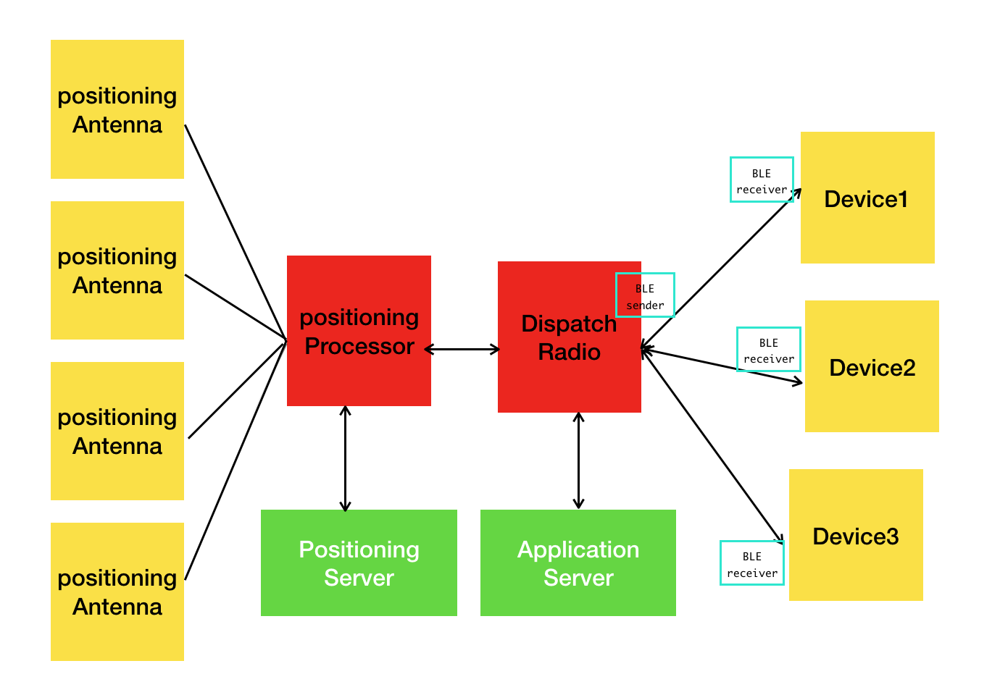

# CSE108_IPS_model_checking

## CSE108 prism assignment

5 members team-work, guys work fun and enjoy it! 😙

The aim is to check the reliability of IPS(indoor positioning systems) using prism, which is adapted from CTMC model provided by CSE108 extra material.

## A real implementation

## Model realization

### model1

failure situation:

1. Any of `Sensor` can fail.  If available **sensor < 3**, the whole system is shut down

2. `Input/Output processors` can fail.  The fail can be **permanent** fault or **transient** fault.

3. The processors failure could be divided into two parts:

    - If permanent, the processor can be recovered by rebooting itself.  

    - If I/O processor is unavailable, M will be unable to read data from I or pass instruction to O.  In such case, M will be forced to skip the current operation cycle.  If the number of consecutive cycles skipped exceeds the limit, the system is shut down.

4. `Main processor` processor can fail. If so, the system is shut down.

-----

### model2

1. The failure of `Sensor` is the same of model1.

2. `Input/Output processors` can fail. If available **processors < 3**, the whole system is shut down.

3. Permanent and transient situation is the same as the model1

4. `Main processor` failure is the same as model1.
